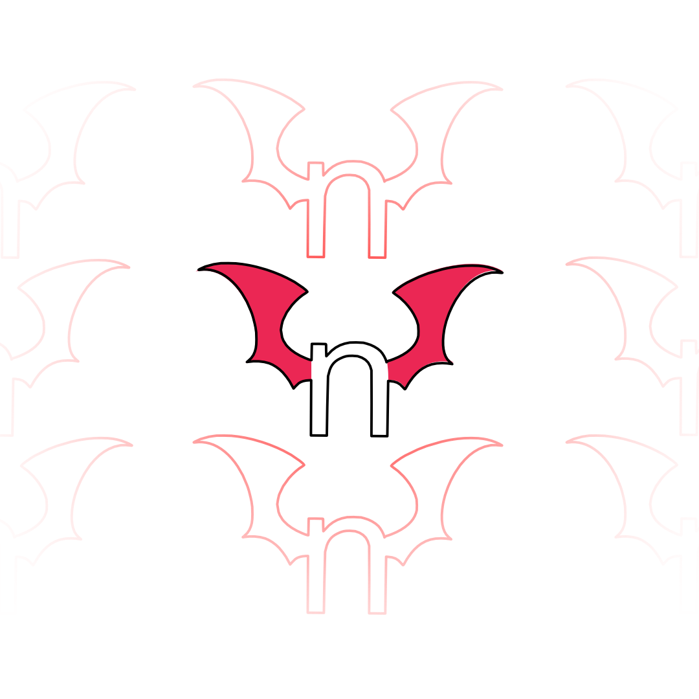

<h1 align="center">HentaiTML</h1>

<h1 align="center">nHentai Code Finder</h1>

# WTF is this?
A Webapp (sort-of) with NO third-party frameworks.

# Kay... so R U an M?
Well, designing a goddamn web without any framework despite available, might already making my master <[nmluci](https://github.com/nmluci)> an M, BUT no she's not, she's a coffee-addict!

# What these freak could do then?
- Searching Doujin
- Get Random Doujin

That's all

# What is the point of these?
To fulfill and manifests human's weak mind through divine blessing ;v

# Nutrition Label
| Object | Uses             | 
---------|-------------------
| Python | Flask            |
|        | Nhentai          |
| JS     | "Some" Backend   |
| CSS    | Styling          |
| HTML   | Barebone         | 

# How to use on your own?
Just run the app.py
Be sure to install all dependencies before-hand (master said she's to tired to mention all of it =,=)
# Powered by 1000% caffeinated source code!
# - nmluci